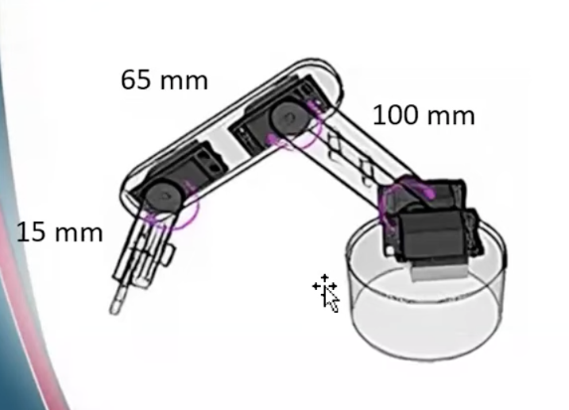

# Forward kinematics

## Task Description

The robotic arm shown below consists of four motors (4-DOF).

The objective is to derive the **Forward Kinematics** equations of the robotic arm in order to determine the position of the end effector in the Cartesian coordinate system:

- X
- Y
- Z

### Arm Dimensions

The given link dimensions are:

| Link | Length |
|------|--------|
| Link 1 | 100 mm |
| Link 2 | 65 mm |
| Link 3 | 15 mm |

The base height is not provided in the task, so it is assumed to be:

\[
H = 50\ mm
\]

---

## Joint Variables

The four joint angles are defined as:

- $\theta_1$: Base rotation around the Z-axis.
- $\theta_2$: Rotation of the first arm link.
- $\theta_3$: Rotation of the second arm link.
- $\theta_4$: Rotation of the end-effector link.

---

## Forward Kinematics

First, the horizontal distance from the base axis to the end effector is calculated as:

\[
r =
100\cos(\theta_2)
+
65\cos(\theta_2+\theta_3)
+
15\cos(\theta_2+\theta_3+\theta_4)
\]

### X Coordinate

\[
X =
r\cos(\theta_1)
\]

Therefore:

\[
\boxed{
X =
[
100\cos(\theta_2)
+
65\cos(\theta_2+\theta_3)
+
15\cos(\theta_2+\theta_3+\theta_4)
]
\cos(\theta_1)
}
\]

### Y Coordinate

\[
Y =
r\sin(\theta_1)
\]

Therefore:

\[
\boxed{
Y =
[
100\cos(\theta_2)
+
65\cos(\theta_2+\theta_3)
+
15\cos(\theta_2+\theta_3+\theta_4)
]
\sin(\theta_1)
}
\]

### Z Coordinate

The vertical position is calculated by adding the assumed base height:

\[
\boxed{
Z =
50
+
100\sin(\theta_2)
+
65\sin(\theta_2+\theta_3)
+
15\sin(\theta_2+\theta_3+\theta_4)
}
\]

---

## Final Forward Kinematics Equations

The final position of the end effector is:

\[
\boxed{
X =
[
100\cos(\theta_2)
+
65\cos(\theta_2+\theta_3)
+
15\cos(\theta_2+\theta_3+\theta_4)
]
\cos(\theta_1)
}
\]

\[
\boxed{
Y =
[
100\cos(\theta_2)
+
65\cos(\theta_2+\theta_3)
+
15\cos(\theta_2+\theta_3+\theta_4)
]
\sin(\theta_1)
}
\]

\[
\boxed{
Z =
50
+
100\sin(\theta_2)
+
65\sin(\theta_2+\theta_3)
+
15\sin(\theta_2+\theta_3+\theta_4)
}
\]

---

## Assumptions

- The robotic arm has 4 degrees of freedom.
- The link lengths are 100 mm, 65 mm, and 15 mm.
- The base height is assumed to be 50 mm because it is not specified in the task.
- $\theta_1$ represents rotation around the vertical Z-axis.
- $\theta_2$, $\theta_3$, and $\theta_4$ describe the motion of the arm links.
- All angles are measured in degrees or radians consistently when applying the equations.

---

## Result

Using the four joint angles as inputs, the Forward Kinematics equations calculate the Cartesian position of the end effector:

\[
\boxed{P = [X,\ Y,\ Z]^T}
\]

These equations can be used to determine the position of the robotic arm's end effector for different joint configurations.
